# Lab 04: Enterprise LAN Security Assessment

**Name:** Hammad Alajmi
**Course:** IT 335
**Date:** March 31, 2026

---

## Introduction

In this lab I worked as a security engineer for Winslow Bay Municipal Utility District (WBMUD), which is a fictional water utility that serves around 1.4 million residents. The goal was to build on the network I already created in Lab 4.1 and extend it by simulating a real cybersecurity attack called Shellshock, investigating a security incident, and proposing a full remediation plan.

Water and wastewater systems are considered critical national infrastructure in the United States and nearly 70% of inspected utilities failed basic security standards in 2024. This lab gave me a much better understanding of how attackers move through networks, how vulnerabilities like Shellshock actually work, and what security controls need to be in place to stop them.

---

## Part 1: Network Architecture

### Topology Description

For my WBMUD network I created four separate segments each with their own IP range and purpose:

* **IT Operations:** 10.1.10.0/24
* **OT Network:** 192.168.50.0/24
* **Remote Pump Station:** 172.16.5.0/24
* **DMZ (Attacker):** 203.0.113.100

---

### OSI Layer 1 Reflection

Layer 1 is the **Physical layer** and is responsible for transmitting raw bits over a physical medium.

In this lab Layer 1 is represented by:

* Copper straight through cables (PCs ↔ switches)
* Switch ↔ router connections
* Serial DCE cables between routers (WAN)

Without Layer 1, nothing else works.

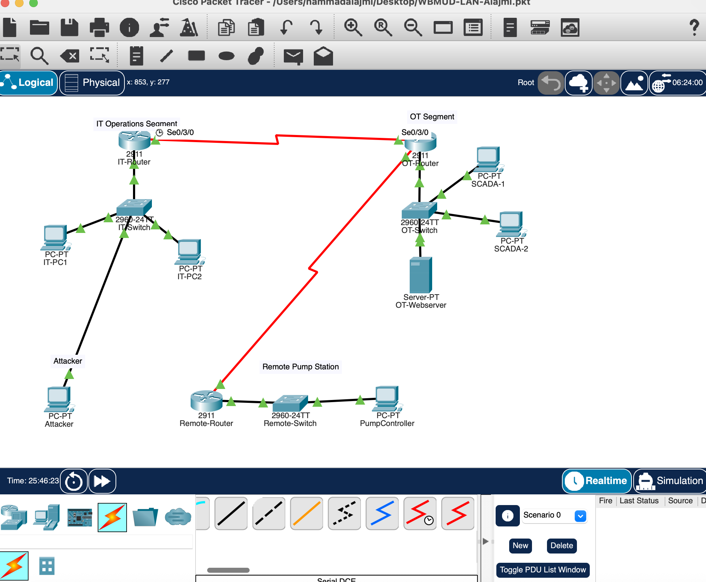

---

### OSI Layer 2 Reflection

Layer 2 is the **Data Link layer**, responsible for frame delivery using MAC addresses.

Switches:

* Maintain MAC address tables
* Forward frames only to correct ports

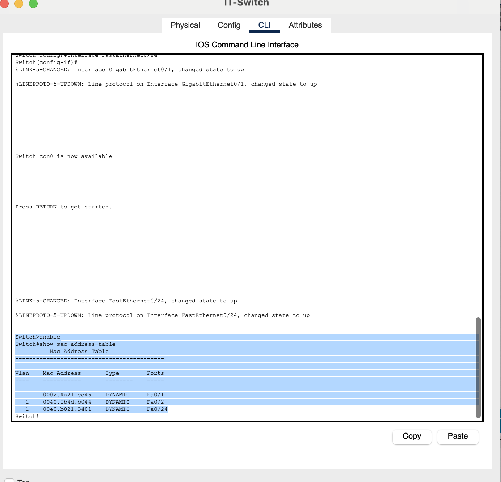

---

### OSI Layer 3 Reflection

Layer 3 is the **Network layer**, responsible for IP addressing and routing.

* Static routes configured on routers
* Enables communication between networks

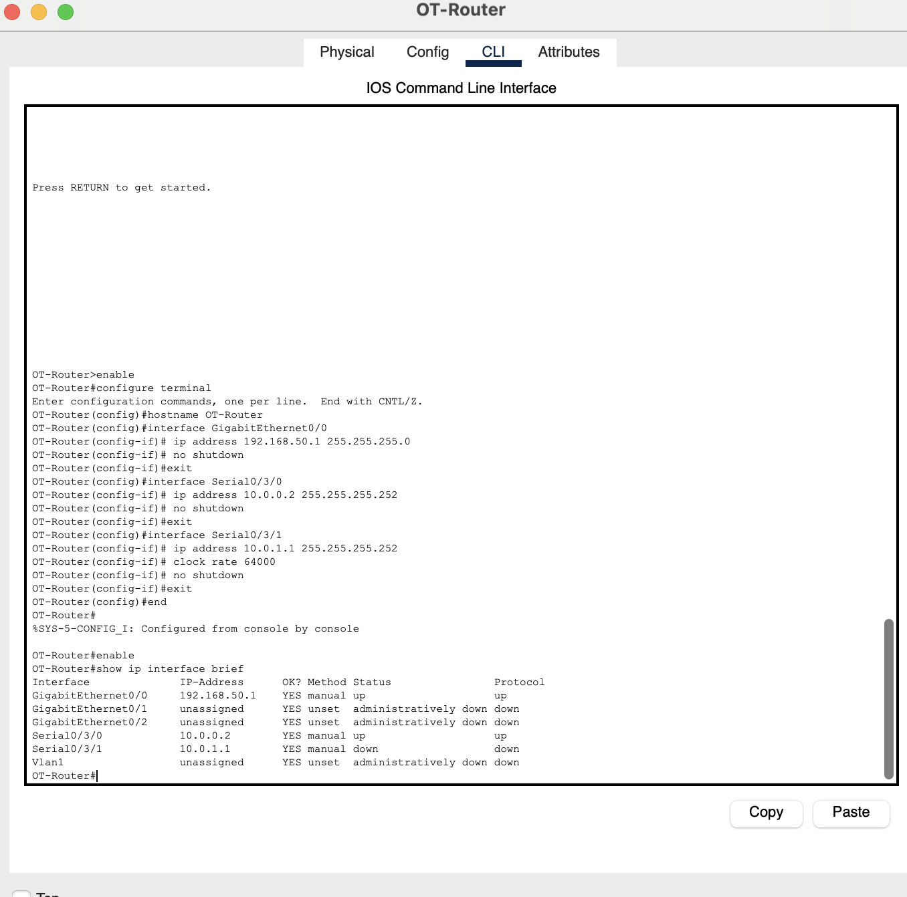
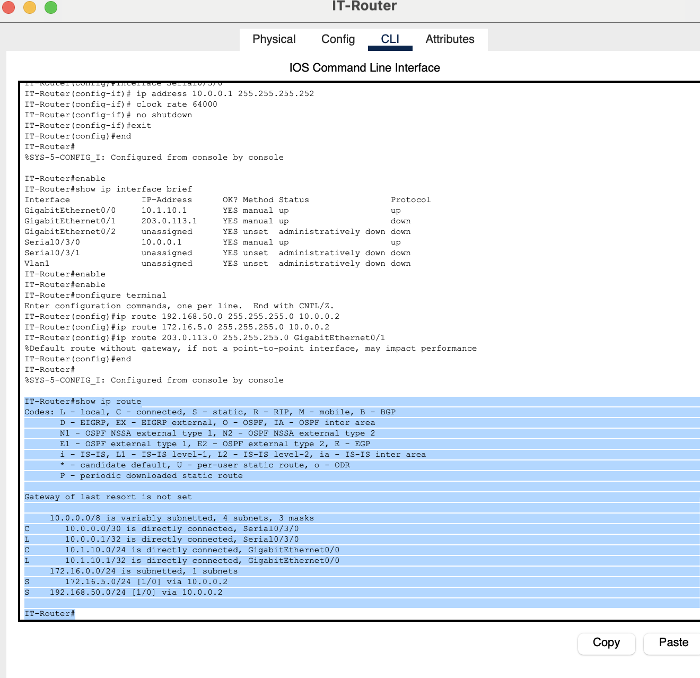
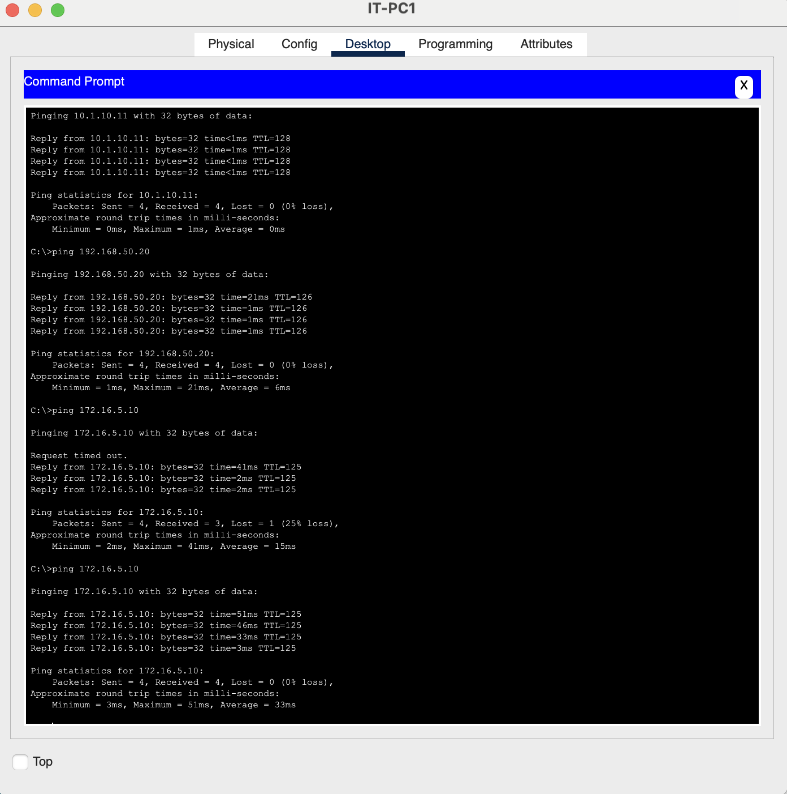

---

### Troubleshooting Notes

* **Issue 1:** Serial ports missing → Fixed by adding WIC-2T module
* **Issue 2:** Router interfaces down → Fixed using `no shutdown`
* **Issue 3:** Ping failure → Fixed by enabling serial interfaces and adding routes

---

## Part 2: Protocol Security Analysis

### TCP vs UDP

* **TCP:** Stateful, reliable, secure tracking
* **UDP:** Faster but stateless and harder to monitor

SCADA often uses UDP → requires specialized monitoring.

---

### HTTP vs HTTPS

* **HTTP:** Plain text (insecure)
* **HTTPS:** Encrypted using TLS/SSL

Used to protect SCADA systems.

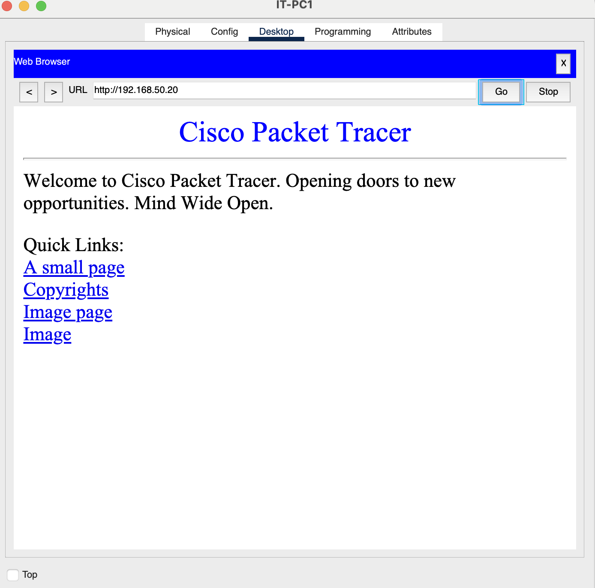
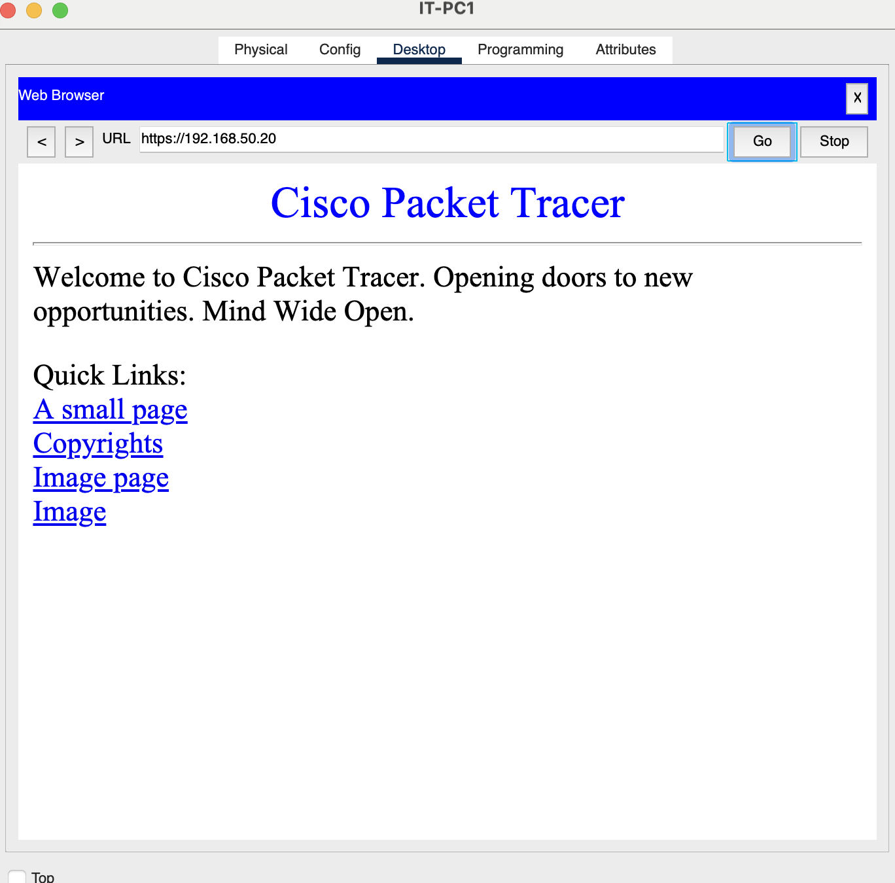

---

### OSI Layer Mapping for Encryption

* TLS/SSL operates at **Layer 7**
* Runs on TCP (**Layer 4**)

Encrypts data before transmission.

---

### SSH vs Telnet

* **Telnet:** Plain text (insecure)
* **SSH:** Fully encrypted

Routers configured with:

```
transport input ssh
```

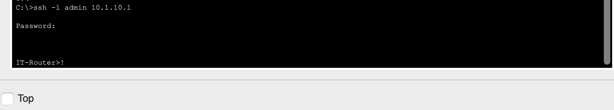

---

## Part 3: Shellshock Vulnerability Assessment

### Web Server Configuration

* Server IP: 192.168.50.20
* Apache with HTTP/HTTPS
* Vulnerable CGI endpoint

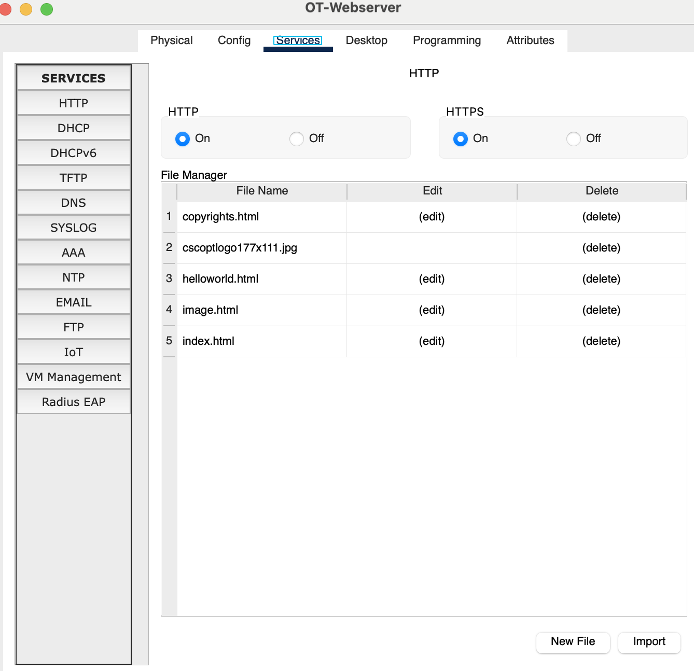

---

### Exploit Simulation

```
curl -A "() { :; }; echo 'Shellshock Vulnerable'" http://192.168.50.20/cgi-bin/test.cgi
```

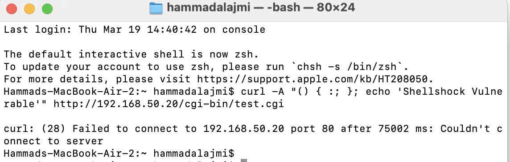

---

### Analysis

**Exploitation Path**

* Bash executes malicious environment variables

**LAMP Stack**

* Linux → OS
* Apache → receives request
* Bash → executes payload

**Impact**

* Remote code execution
* SCADA compromise
* Possible water system manipulation

**Mitigation**

* Patch Bash
* Deploy WAF
* Enforce segmentation

**CERT/CC Role**

* Coordinated disclosure (VU#252743)

---

## Part 4: Incident Response

### Attack Path Reconstruction

1. Initial Access → Shellshock exploit
2. Privilege Escalation → Apache access
3. Lateral Movement → SSH to SCADA
4. Data Exfiltration → 2.3 GB stolen

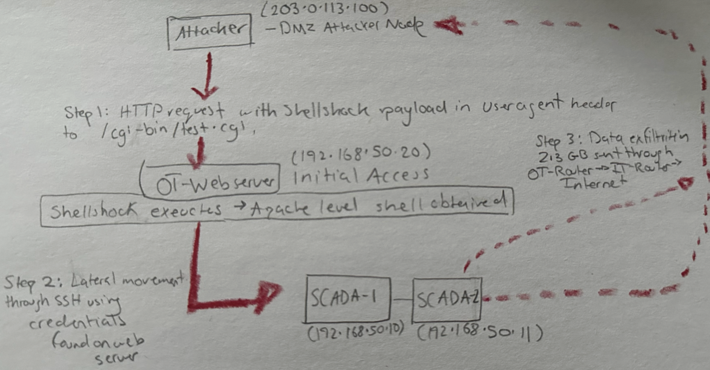
---

### Root Cause Analysis

| Category             | What Went Wrong     | Missing Control  |
| -------------------- | ------------------- | ---------------- |
| Unpatched Software   | Vulnerable Bash     | Patch management |
| Network Segmentation | No firewall         | NGFW             |
| Access Control       | Credentials exposed | Least privilege  |
| Monitoring           | No alerts           | IDS + SIEM       |

---

### Remediation Plan

**Immediate**

* Isolate OT network
* Reset credentials

**Short-Term**

* Patch systems
* Add firewall rules
* Enable logging

**Long-Term**

* Zero Trust architecture
* Reverse proxy
* Full vulnerability scans

**Monitoring**

* Snort / Suricata
* SIEM alerts

**Organizational**

* Training
* Patch policy
* WaterISAC participation

---

## Part 5: OSI Model Mapping Summary

| Activity   | Layer | Technology |
| ---------- | ----- | ---------- |
| Cables     | 1     | Physical   |
| MAC        | 2     | Ethernet   |
| IP Routing | 3     | IPv4       |
| TCP HTTP   | 4     | TCP        |
| UDP SNMP   | 4     | UDP        |
| SSH        | 4/7   | Port 22    |
| HTTP       | 7     | Port 80    |
| HTTPS      | 7     | TLS 443    |
| Shellshock | 7     | CGI/Bash   |
| Telnet     | 4/7   | Port 23    |

---

## Reflection

This lab built directly on Lab 4.1 and added depth to my understanding of network security.

The Shellshock simulation made attacks feel real because I executed the command and understood each step. It showed how a simple unpatched Bash vulnerability can lead to full system compromise.

The incident response section showed that security failures are often due to missing processes, not just technical flaws. The attacker moved freely because monitoring and controls were absent.

This lab reinforced how critical network segmentation is in OT environments. Without it, attackers can pivot from IT systems to SCADA systems, which can have real-world consequences.
